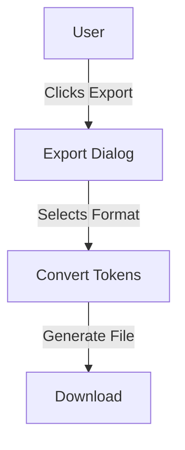

# Documentation Images

This directory contains screenshots and images used in the project documentation.

## Required Screenshots

To complete the documentation, we need the following screenshots:

### 1. Token Palette - Light Mode
**Filename**: `token-palette-light.png`
**Description**: Design tokens displayed in light theme
**Size**: 1920x1080 (recommended)
**Status**: ⏳ Pending

### 2. Token Palette - Dark Mode
**Filename**: `token-palette-dark.png`
**Description**: Design tokens displayed in dark theme
**Size**: 1920x1080 (recommended)
**Status**: ⏳ Pending

### 3. Components Showcase
**Filename**: `components-showcase.png`
**Description**: Component library overview showing multiple components
**Size**: 1920x1080 (recommended)
**Status**: ⏳ Pending

### 4. Export Dialog
**Filename**: `export-dialog.png`
**Description**: Export functionality dialog with format options
**Size**: Actual dialog size
**Status**: ⏳ Pending

### 5. Typography System
**Filename**: `typography-system.png`
**Description**: Typography tokens and scales
**Size**: 1920x1080 (recommended)
**Status**: ⏳ Pending

### 6. Spacing System
**Filename**: `spacing-system.png`
**Description**: Spacing tokens visualization
**Size**: 1920x1080 (recommended)
**Status**: ⏳ Pending

### 7. Theme Toggle
**Filename**: `theme-toggle.gif` (animated)
**Description**: Animated demonstration of theme switching
**Size**: 800x600 (recommended)
**Status**: ⏳ Pending (optional)

---

## How to Add Screenshots

### Step 1: Run the Application

```bash
# Start the development server
npm run dev

# Or preview production build
npm run build
npm run preview
```

The application will open at `http://localhost:3000`

### Step 2: Navigate to the Page

Navigate to the specific page or component you want to screenshot:
- **Tokens**: Main tokens page
- **Components**: `/components` route
- **Export**: Click export button

### Step 3: Take the Screenshot

#### Using Browser Tools

**Chrome/Edge:**
1. Open DevTools (F12)
2. Press `Ctrl+Shift+P` (Cmd+Shift+P on Mac)
3. Type "screenshot"
4. Select "Capture full size screenshot"

**Firefox:**
1. Open DevTools (F12)
2. Click the camera icon in the toolbar
3. Select "Save full page"

#### Using Screenshot Tools

**macOS:**
- Full screen: `Cmd+Shift+3`
- Selection: `Cmd+Shift+4`

**Windows:**
- Snipping Tool or `Win+Shift+S`

**Linux:**
- GNOME Screenshot or `PrtScn`

### Step 4: Optimize the Image

Optimize images to reduce file size:

**Online Tools:**
- [TinyPNG](https://tinypng.com/) - PNG compression
- [Squoosh](https://squoosh.app/) - Universal image optimizer
- [ImageOptim](https://imageoptim.com/) - macOS app

**Command Line:**
```bash
# Install imageoptim-cli (macOS)
brew install imageoptim-cli

# Optimize images
imageoptim *.png
```

**Target Size:** Keep file sizes under 500KB per image

### Step 5: Name and Place File

1. Name according to the convention above
2. Place in this `/docs/images/` folder
3. Verify the filename matches exactly

### Step 6: Reference in Documentation

Use in markdown files:

```markdown

```

**Examples:**

```markdown
# In root README.md


# In docs/README.md

```

---

## Screenshot Guidelines

### Quality Standards

- **Resolution**: Minimum 1920x1080 for full page screenshots
- **Format**: PNG for UI screenshots, SVG for diagrams
- **Compression**: Optimize to keep under 500KB
- **Color Space**: sRGB
- **DPI**: 72 DPI (web standard)

### What to Capture

#### DO ✅

- Capture the full relevant area
- Use high contrast for visibility
- Show realistic data/content
- Capture both light and dark themes
- Include important UI elements
- Use clean, production-ready views

#### DON'T ❌

- Include personal information
- Show development tools/console
- Capture low-quality/blurry images
- Include browser chrome (unless relevant)
- Show error states (unless demonstrating fixes)
- Include placeholder "Lorem ipsum" everywhere

### Accessibility

- **Alt Text**: Always provide descriptive alt text
- **Contrast**: Ensure screenshots are clear and readable
- **Context**: Provide caption or description where needed

**Example:**
```markdown

*Figure 1: Color tokens displayed in light theme*
```

---

## Animated GIFs (Optional)

For demonstrating interactions:

### Creating GIFs

**Tools:**
- [ScreenToGif](https://www.screentogif.com/) (Windows)
- [Kap](https://getkap.co/) (macOS)
- [Peek](https://github.com/phw/peek) (Linux)
- [LICEcap](https://www.cockos.com/licecap/) (Cross-platform)

### GIF Guidelines

- **Duration**: 3-10 seconds max
- **Size**: Under 2MB
- **Frame Rate**: 10-15 fps
- **Dimensions**: 800x600 or smaller
- **Loops**: Infinite loop

### Example Use Cases

- Theme switching animation
- Export flow demonstration
- Component interaction demos
- Navigation walkthroughs

---

## Diagrams and Charts

For architecture or flow diagrams:

### Creating Diagrams

**Tools:**
- [Excalidraw](https://excalidraw.com/) - Hand-drawn style
- [diagrams.net](https://app.diagrams.net/) - Professional diagrams
- [Mermaid](https://mermaid.js.org/) - Markdown-based diagrams

### Diagram Format

**Preference Order:**
1. **SVG** - Best for diagrams (scalable, small file size)
2. **PNG** - If SVG not available

**Mermaid Example:**


---

## File Naming Convention

Use lowercase with hyphens:

```
✅ Good:
- token-palette-light.png
- components-showcase.png
- export-dialog-step1.png

❌ Bad:
- TokenPalette_Light.png
- Components Showcase.png
- exportDialog.PNG
```

---

## Updating Screenshots

When UI changes significantly:

1. **Identify outdated screenshots**
2. **Retake screenshots** following the same guidelines
3. **Replace old files** (keep same filename)
4. **Verify all references** still work
5. **Commit changes** with descriptive message

Example commit:
```bash
git add docs/images/
git commit -m "docs(images): update token-palette screenshots for new UI"
```

---

## Image Inventory

| Filename | Status | Date Added | Last Updated | Used In |
|----------|--------|------------|--------------|---------|
| token-palette-light.png | ⏳ Pending | - | - | README.md |
| token-palette-dark.png | ⏳ Pending | - | - | README.md |
| components-showcase.png | ⏳ Pending | - | - | README.md, docs/README.md |
| export-dialog.png | ⏳ Pending | - | - | README.md |
| typography-system.png | ⏳ Pending | - | - | docs/ARCHITECTURE.md |
| spacing-system.png | ⏳ Pending | - | - | docs/ARCHITECTURE.md |

**Legend:**
- ⏳ Pending - Not yet created
- ✅ Complete - Created and up to date
- 🔄 Outdated - Needs updating

---

## Contributing Screenshots

When contributing screenshots:

1. **Follow all guidelines** in this document
2. **Test images locally** in markdown preview
3. **Include in your PR** with clear description
4. **Update this README** with inventory info

---

## Questions?

If you have questions about screenshots or need help:

1. Check existing examples in documentation
2. Ask in GitHub Discussions
3. Create an issue with the `documentation` label

---

**Last Updated**: December 2025

**Maintainers**: Please update the inventory table when adding/updating images!
