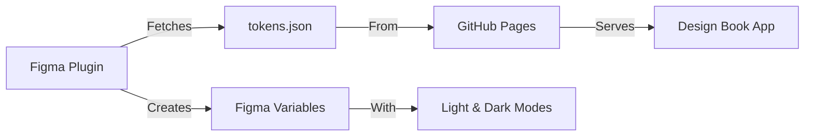

# 🎨 Design Book - Figma Plugin

A Figma plugin that imports your Design Book design tokens as Figma Variables with full light/dark theme support.

## 🌟 Features

- ✅ **Auto-fetch tokens** from your live GitHub Pages site
- ✅ **Creates Figma Variables** for all color tokens (99 tokens)
- ✅ **Light & Dark modes** automatically set up
- ✅ **Always in sync** with your design system
- ✅ **One-click import** - simple UI

## 📦 What Gets Imported

The plugin imports all color tokens from your Design Book:

- **Call-to-Action (CTA)** - Primary action colors
- **Primary** - Core interface elements
- **Secondary** - Secondary actions
- **Danger** - Error states
- **Success** - Positive feedback
- **Warning** - Cautionary states
- **Link** - Navigation colors
- **Surface** - Container backgrounds
- **Background** - Page backgrounds
- **Border** - Dividers
- **Text** - Typography colors
- **Icons** - Icon colors
- **Strong Colors (1-20)** - Vibrant accents
- **Subtle Colors (1-20)** - Soft accents
- **Dark** - Dark contrast accents

**Total:** 99 color tokens with light and dark variants

## 🚀 Installation & Usage

### Option 1: Install from Figma Community (Recommended)

1. Open Figma
2. Go to Plugins → Browse Community Plugins
3. Search for "Design Book - Token Importer"
4. Click "Install"

### Option 2: Local Development

1. **Build the plugin:**
   ```bash
   cd figma-plugin
   npm install
   npm run build
   ```

2. **Load in Figma:**
   - Open Figma Desktop App
   - Go to Plugins → Development → Import plugin from manifest
   - Select `figma-plugin/manifest.json`

3. **Run the plugin:**
   - Right-click on canvas → Plugins → Development → Design Book - Token Importer
   - Click "Import Tokens"
   - Wait for import to complete

## 🔧 How It Works



1. **Plugin opens** → Shows UI with import button
2. **User clicks "Import Tokens"** → Fetches `tokens.json` from GitHub Pages
3. **Plugin processes tokens** → Creates/updates Figma Variable Collection
4. **Sets up modes** → Light mode + Dark mode
5. **Imports all tokens** → Each token becomes a Figma Variable
6. **Done!** → Variables ready to use in your designs

## 📁 File Structure

```
figma-plugin/
├── manifest.json          # Plugin configuration
├── code.ts               # Main plugin logic (TypeScript)
├── ui.html               # Plugin user interface
├── tsconfig.json         # TypeScript config
├── package.json          # Dependencies
└── README.md            # This file
```

## 🔗 Data Source

The plugin fetches tokens from:
```
https://davidbudzik.github.io/design-system-tokens_UI_components/tokens.json
```

This file is auto-generated during build and contains:
- All 99 color tokens
- Light and dark mode variants
- Token metadata and descriptions

## 🎯 Using Variables in Figma

After importing:

1. **Select any layer** in Figma
2. **Click on Fill/Stroke** color
3. **Choose "Variables"** tab
4. **Select a token** from "Design Book Tokens" collection
5. **Switch themes** using the mode selector (Light/Dark)

### Example Variables Created:

```
Design Book Tokens/
├── Light Mode
│   ├── cta-cta-default: #E03600
│   ├── cta-cta-hover: #FA4D1A
│   ├── primary-primary-default: #242424
│   └── ...99 total tokens
│
└── Dark Mode
    ├── cta-cta-default: #FF5C1A
    ├── cta-cta-hover: #FF7038
    ├── primary-primary-default: #E0E0E0
    └── ...99 total tokens
```

## 🔄 Updating Tokens

To update tokens in Figma:

1. **Update tokens** in your Design Book app
2. **Run build** to regenerate `tokens.json`:
   ```bash
   npm run build
   ```
3. **Deploy** to GitHub Pages (auto-deploys on push)
4. **Re-run plugin** in Figma to fetch latest tokens

The plugin will update existing variables and create new ones as needed.

## 🛠️ Development

### Build Plugin

```bash
# Install dependencies
npm install

# Build once
npm run build

# Watch mode (rebuilds on save)
npm run watch
```

### Test Plugin

1. Make changes to `code.ts` or `ui.html`
2. Run `npm run build`
3. In Figma: Plugins → Development → Reload plugin
4. Run plugin again to test

### Customize

**Change data source:**
Edit `code.ts` line 4:
```typescript
const TOKENS_URL = 'https://your-domain.com/tokens.json';
```

**Modify UI:**
Edit `ui.html` - update styles, text, or behavior

**Add features:**
Edit `code.ts` - extend token processing or add new variable types

## 📋 Requirements

- **Figma Desktop App** (plugin doesn't work in browser version for network access)
- **Node.js 18+** (for building)
- **TypeScript 5+**

## 🐛 Troubleshooting

### "Failed to fetch tokens"

- ✅ Check GitHub Pages is deployed
- ✅ Verify `tokens.json` exists at the URL
- ✅ Ensure you're using Figma Desktop (not browser)
- ✅ Check network connection

### "198 errors" when importing

- This was fixed! The plugin now uses the correct format
- If you still see this, ensure you're using the latest version

### Variables not appearing

- Check "Design Book Tokens" collection exists
- Look in the Local Variables panel (not Styles)
- Make sure the layer type supports variables (shapes, text, etc.)

## 📖 Related Documentation

- [Design Book Live Site](https://davidbudzik.github.io/design-system-tokens_UI_components/)
- [Token Setup Guide](../TOKENS_SETUP.md)
- [Token Reference](../TOKENS_INDEX.md)
- [Figma Variables Docs](https://help.figma.com/hc/en-us/articles/15339657135383-Guide-to-variables-in-Figma)

## 🚢 Publishing to Figma Community

To publish this plugin:

1. **Complete plugin details** in Figma
2. **Add plugin icon** (512x512px)
3. **Write description** (use content from this README)
4. **Submit for review** via Figma

Once published, users can install via:
```
Plugins → Browse Community → "Design Book"
```

## 📝 License

Same license as the parent Design Book project.

## 🤝 Contributing

Improvements welcome! Submit PRs to the main repository.

---

**Made with ❤️ for designers and developers**

For issues or questions, please open an issue on GitHub.
